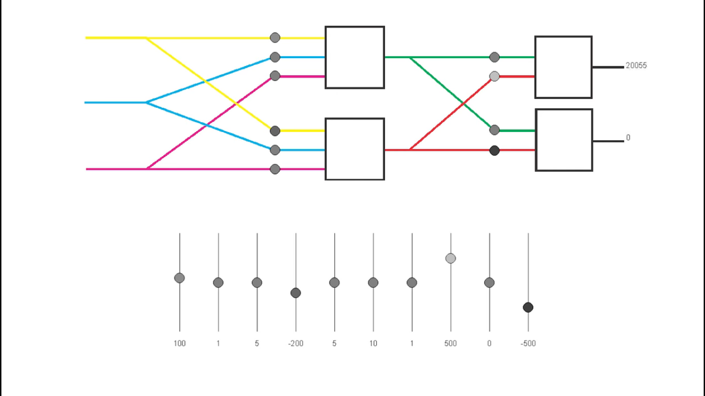

# IA Projects
## pequenos projetos com machine learn e data science
---

### pig-dog
define se um animal é um porco ou um cachorro de acordo com suas características...

### neuralNetwor
protótipo de uma rede neural feito na mão

>
imagem tirada do vídeo '[Inteligência Artificial destruindo no dinossauro da Google! (Rede Neural)](https://www.youtube.com/watch?v=NZlIYr1slAk)' do canal [UniversoProgramado](https://www.youtube.com/channel/UCf_kacKyoRRUP0nM3obzFbg)